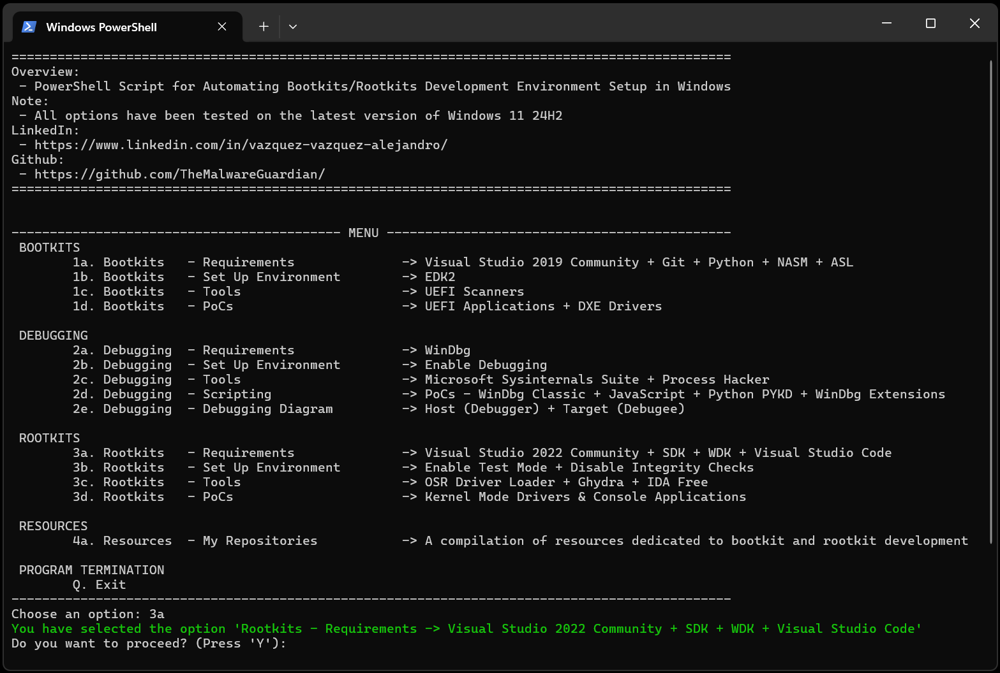

# 🏴‍☠️ Bootkits & Rootkits Development Environment

This repository is part of my effort to make Bootkit & Rootkit development more accessible. Setting up a proper environment for low-level development can be tedious and time-consuming, so the scripts provided here automate the setup process, making it easier to configure and start experimenting with bootkits and rootkits.

<p align="center">

</p>


---
---
---


## 📑 Table of Contents

* [Setting Up the Environment for Developing Bootkits and Rootkits on Windows](#environmentwindows)
* [Setting Up the Environment for Developing Bootkits and Rootkits on Linux](#environmentlinux)
* [Additional Resources](#additionalresources)
* [Example Projects](#exampleprojects)
* [Contact](#contact)


---
---
---


<div id='environmentwindows'/>

## 🖥️ Setting Up the Environment for Developing Bootkits and Rootkits on Windows

This [PowerShell script](https://github.com/TheMalwareGuardian/Bootkits-Rootkits-Development-Environment/blob/main/Scripts/Setup_Development_Environment_Windows.ps1) is meticulously crafted to automate the setup of a development environment specifically tailored for creating [UEFI](https://wiki.osdev.org/UEFI) Bootkits and [Kernel](https://learn.microsoft.com/en-us/windows-hardware/drivers/kernel/) Rootkits on Windows. It streamlines the otherwise manual and time-consuming tasks of installing necessary tools and configuring [TianoCore](https://www.tianocore.org/) [EDK2](https://github.com/tianocore/edk2) (EFI Development Kit) and [WDK](https://learn.microsoft.com/en-us/windows-hardware/drivers/download-the-wdk) (Windows Driver Kit), allowing developers to focus more on bootkits/rootkits innovation and less on setup 😉.

### How to Execute

To automate the creation and setup of your development environment, follow these steps:

1. Open PowerShell (Some options require administrator permissions):
	- Open PowerShell by searching for it in the Start Menu.
	- For administrator permissions, right-click PowerShell and select Run as Administrator.

2. Set the Execution Policy (Optional):
	- If you encounter an error related to script execution, you can temporarily change the execution policy by running: 'Set-ExecutionPolicy -Scope Process -ExecutionPolicy Bypass'. This allows scripts to run in the current session without permanently changing system settings. Alternatively, to remove all restrictions, use: 'Set-ExecutionPolicy Unrestricted'.

3. Navigate to the Script Directory:
	- Use the cd command to navigate to the folder containing the script.

4. Execute the Script:
	- Run the script by entering '.\Setup_Development_Environment_Windows.ps1'

5. Follow the Prompts:
	- Respond to the on-screen prompts to select your desired action.

### Usage Example

<p align="center">
	
</p>

The script simplifies the following steps:

```
==============================================================================================
Overview:
- PowerShell Script for Automating Bootkits/Rootkits Development Environment Setup in Windows
Note:
- All options have been tested on the latest version of Windows 11 24H2
LinkedIn:
- https://www.linkedin.com/in/vazquez-vazquez-alejandro/
Github:
- https://github.com/TheMalwareGuardian/
==============================================================================================


------------------------------------------- MENU ---------------------------------------------
BOOTKITS
		1a. Bootkits   - Requirements              -> Visual Studio 2019 Community + Git + Python + NASM + ASL
		1b. Bootkits   - Set Up Environment        -> EDK2
		1c. Bootkits   - Tools                     -> UEFI Scanners
		1d. Bootkits   - PoCs                      -> UEFI Applications

DEBUGGING
		2a. Debugging  - Requirements              -> WinDbg
		2b. Debugging  - Set Up Environment        -> Enable Debugging
		2c. Debugging  - Tools                     -> Microsoft Sysinternals Suite + Process Hacker
		2d. Debugging  - Scripting                 -> PoCs - WinDbg Classic + JavaScript + Python PYKD + WinDbg Extensions
		2e. Debugging  - Debugging Diagram         -> Host (Debugger) + Target (Debugee)

ROOTKITS
		3a. Rootkits   - Requirements              -> Visual Studio 2022 Community + SDK + WDK + Visual Studio Code
		3b. Rootkits   - Set Up Environment        -> Enable Test Mode + Disable Integrity Checks
		3c. Rootkits   - Tools                     -> OSR Driver Loader + Ghydra + IDA Free
		3d. Rootkits   - PoCs                      -> Kernel Mode Drivers & Console Applications

RESOURCES
		4a. Resources  - My Repositories           -> A compilation of resources dedicated to bootkit and rootkit development

PROGRAM TERMINATION
		Q. Exit
----------------------------------------------------------------------------------------------
Choose an option: 3a
You have selected the option 'Rootkits - Requirements -> Visual Studio 2022 Community + SDK + WDK + Visual Studio Code'
Do you want to proceed? (Press 'Y'):
```


---
---
---


<div id='environmentlinux'/>

## 🖥️ Setting Up the Environment for Developing Bootkits and Rootkits on Linux

> **🚧 Coming Soon... 🚧**
> Work in progress. Stay tuned for updates!

| Feature                | Status          |
|------------------------|-----------------|
| Environment Setup      | 🔄 In Progress |
| Malware Examples       | ⏳ Researching |
| Documentation          | ❌ Not Started |


---
---
---


<div id='additionalresources'/>

## 📚 Additional Resources

To help both beginners and experienced developers, I've also put together a collection of useful materials, including videos, articles, malware examples, and other resources to deepen your understanding of bootkits and rootkits:

📌 [TheMalwareGuardian: Awesome Bootkit & Rootkit Development Resources](https://github.com/TheMalwareGuardian/Awesome-Bootkits-Rootkits-Development)


---
---
---


<div id='exampleprojects'/>

## 🚀 Example Projects

If you're looking for simple Bootkit & Rootkit projects to get started, check out these repositories, where I share foundational examples to help you build your own:

📌 [TheMalwareGuardian: Abismo - Windows UEFI Bootkit](https://github.com/TheMalwareGuardian/Abismo)

📌 [TheMalwareGuardian: Bentico - Windows Rootkit](https://github.com/TheMalwareGuardian/Bentico)


---
---
---


<div id='contact'/>

## 📬 Contact

If you have questions, need further clarification, or are interested in collaboration, feel free to reach out via [LinkedIn](https://www.linkedin.com/in/vazquez-vazquez-alejandro/).
